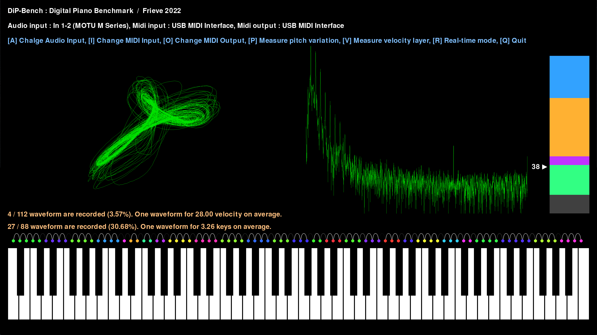

# DiP-Bench
A tool for analyzing the sound quality of digital pianos.

(英語に続き日本語の解説があります)

A tool for analyzing the sound quality of digital pianos.

 

## How to download and install on Windows

Note:
This app requires a PC with 1920x1080, 100% or more display area.

Latest version for 64bit Windows can be downloaded from the following page.

https://github.com/Frieve-A/dipbench/releases

Unzip the downloaded zip file and run the dipbench.exe to launch the app. No installation is required.

 

## How to execute on other platforms

This application is written in Python.
Follow the steps below to execute the Python code of the DiP-Bench.

1. git clone https://github.com/Frieve-A/dipbench.git
2. pip install -r requirements.txt
3. python dipbench.py

 

## How to use

Connect the digital piano to be measured to the PC and launch the DiP-Bench app.

Press A, I and O key on your keyboard and select the MIDI and audio devices you want to use for measurements.

Press P key on the keyboard to start sound quality measurement in the pitch direction.

After measurement, you can click the piano keyboard on the screen or use the left and right arrow keys on the keyboard to check the measured waveform and sound.

Press V key on the keyboard to start sound velocity layer measurement.

After measurement, you can click the bar on the right of the screen or use the up and down arrow keys on the keyboard to check the measured waveform and sound.

Press R key on the keyboard to start real-time waveform visualization.

Press the ESC key on the keyboard to exit real-time mode and return to the first screen.

 

## Keyboard shortcuts

Q : Exit the app

S : Save the measured waveforms as wav files in the app folder.

F11 : Switch to full screen

 

---

 

電子ピアノの音質を解析するツールです。

 

## ダウンロードとインストール（Windows）

ご注意）このアプリの動作には1920x1080、100%以上の表示領域を持ったPCが必要です。

以下のページより64bit Windows用の最新バージョンをダウンロードします。

https://github.com/Frieve-A/dipbench/releases

ダウンロードしたzipファイルを解凍し、dipbench.exeファイル起動します。インストールは不要です。

 

## その他のプラットフォームで実行するには

本アプリケーションはPythonで作成されています。
以下の手順でDiP-BenchのPythonコードを実行します。

1. git clone https://github.com/Frieve-A/dipbench.git
2. pip install -r requirements.txt
3. python dipbench.py

 

## 使い方

PCに測定対象の電子ピアノを接続してDiP-Benchアプリを起動します。

キーボードのA、I、Oキーを押して、測定に使用するMIDIとオーディオデバイスを切り替えます。

キーボードのPキーを押して、音程方向の音質測定を開始します。

測定後、画面上のピアノ鍵盤をクリックするか、キーボードの左右キーを押すことで測定した波形と音を確認できます。

キーボードのVキーを押して、ベロシティーレイヤーの測定を開始します。

測定後、画面右のバーをクリックするか、キーボードの上下キーを押すことで測定した波形と音を確認できます。

キーボードのRキーを押して、リアルタイムに波形を可視化するモードに切り替えます。

キーボードのESCキーでリアルタイムモードを抜け最初の画面に戻ります。

## キーボードショートカット

Q : アプリを終了

S : 測定波形をWavファイルとしてアプリのフォルダに保存

F11 : フルスクリーンへの切り替え
